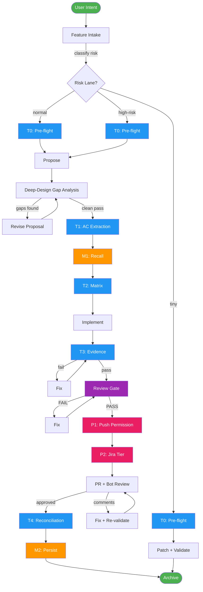
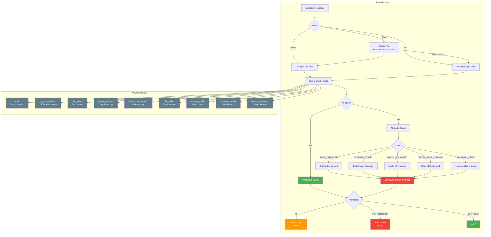

# Unified Harness CLI

A single Rust binary combining the Janus project harness with eval-harness behavior-regression testing. No external dependencies — uses the user's current model context for LLM evaluation.

> ⚗️ **Experimental / opt-in.** The eval-harness (`harness-cli eval …`, all 14 commands) is **not** part of the default build. It is gated behind the `eval` cargo feature and compiles only with `cargo build --release --features eval` (or `cargo install --features eval`). The default binary ships the 9 quality gates without this eval layer. Everything documented below assumes a build with `--features eval`.

---

## Bắt đầu nhanh (cho người mới)

### Bước 1: Cài đặt vào project của bạn

```bash
# Cách 1: One-liner (khuyến nghị)
cd ~/your-project
curl -fsSL https://raw.githubusercontent.com/nano-step/janus/main/scripts/install-harness.sh | bash -s -- --yes

# Cách 2: Từ local (nếu đã clone Janus)
cd ~/your-project
bash ~/janus/scripts/install-harness.sh --yes
```

### Bước 2: Khởi tạo database

```bash
scripts/bin/harness-cli init
```

### Bước 3: Bắt đầu sử dụng

```bash
# Ghi nhận một feature mới
scripts/bin/harness-cli intake --type feature --summary "Add user authentication" --lane normal

# Tạo story
scripts/bin/harness-cli story add --id US-001 --title "Login flow" --lane normal

# Implement xong → ghi nhận trace
scripts/bin/harness-cli trace --summary "Implemented login with OAuth" --outcome pass

# Xem trạng thái
scripts/bin/harness-cli query matrix
```

---

## Cách hoạt động

### Workflow tổng quan



### 9 Gates chi tiết

```mermaid
flowchart LR
    subgraph "Pre-implementation Gates"
        T0[T0: Pre-flight<br/>Check dirty tree<br/>Wrong base branch]
        T1[T1: AC Extraction<br/>Acceptance criteria<br/>verbatim from ticket]
        M1[M1: Recall<br/>Surface relevant<br/>prior fixes]
    end
    
    subgraph "Implementation Gates"
        T2[T2: Matrix<br/>Every AC mapped<br/>to test tier]
        T3[T3: Evidence<br/>Per-AC proof<br/>on disk]
        REVIEW[Review Gate<br/>Reviewer ≠ implementer<br/>Cite evidence]
    end
    
    subgraph "Post-implementation Gates"
        P1[P1: Push Permission<br/>Stop unwanted<br/>push/rewrite]
        P2[P2: Jira Tier<br/>No surprise<br/>teammate-visible writes]
        T4[T4: Reconciliation<br/>Delivered == requested<br/>per AC]
    end
    
    subgraph "Persistence Gates"
        M2[M2: Persist<br/>Future session recalls<br/>this work usefully]
        GCR[GCR Metric<br/>Measures gate adoption<br/>per story]
    end
    
    T0 --> T1 --> M1 --> T2 --> T3 --> REVIEW --> P1 --> P2 --> T4 --> M2 --> GCR
    
    style T0 fill:#2196F3,color:#fff
    style T1 fill:#2196F3,color:#fff
    style T2 fill:#2196F3,color:#fff
    style T3 fill:#2196F3,color:#fff
    style T4 fill:#2196F3,color:#fff
    style M1 fill:#FF9800,color:#fff
    style M2 fill:#FF9800,color:#fff
    style REVIEW fill:#9C27B0,color:#fff
    style P1 fill:#E91E63,color:#fff
    style P2 fill:#E91E63,color:#fff
    style GCR fill:#607D8B,color:#fff
```



### Gate × Lane Matrix

| Gate | tiny | normal | high-risk | Verdict |
|------|:----:|:------:|:---------:|---------|
| **T0** Pre-flight | ✅ | ✅ | ✅ | KEEP — cheap, prevents wasted runs |
| **T1** AC Extraction | — | ✅ | ✅ | KEEP — core correctness anchor |
| **M1** Recall | — | ✅ | ✅ | FIX — 66% stale, needs freshness |
| **T2** Matrix | — | ✅ | ✅ | KEEP for normal+; DOWNGRADE for tiny |
| **T3** Evidence | — | ✅ | ✅ | KEEP for bug-fix/feature |
| **Review** | — | ✅ | ✅ | KEEP for user-facing; DOWNGRADE for docs |
| **P1** Push Permission | — | — | ✅ | KEEP — irreversibility justifies prompt |
| **P2** Jira Tier | — | — | ✅ | KEEP (batched) |
| **T4** Reconciliation | — | ✅ | ✅ | KEEP — closes loop on T1 |
| **M2** Persist | ✅ | ✅ | ✅ | conditional — only if M1 trustworthy |

### Eval Workflow



### Risk Lanes

```
1. EVAL-HARNESS (pre-check) ← Kiểm tra trước khi bắt đầu
   │
   ▼
2. Feature Intake (phân loại risk)
   │
   ▼
3. Implement (làm việc)
   │
   ▼
4. Validate + Review
   │
   ▼
5. Archive (lưu trữ)
```

### Risk Lanes

| Lane | Khi nào | Yêu cầu |
|------|---------|----------|
| **tiny** | 0-1 risk flags | Patch + validate |
| **normal** | 2-3 risk flags | Proposal + review |
| **high-risk** | 4+ flags hoặc auth/data | Full review + E2E test |

### Chuỗi lệnh tối ưu

```bash
# 1. Ghi nhận feature
harness-cli intake --type feature --summary "Add OAuth login" --lane normal
# → Output: Intake #1 recorded.

# 2. Tạo story
harness-cli story add --id US-001 --title "OAuth login flow" --lane normal
# → Output: Story US-001 added.

# 3. Implement code...

# 4. Verify story
harness-cli story verify US-001
# → Output: Story US-001 verification: pass

# 5. Ghi nhận trace
harness-cli trace --summary "Implemented OAuth login" --outcome pass --story US-001
# → Output: Trace #1 recorded.

# 6. Xem matrix
harness-cli query matrix
# → Hiển thị trạng thái tất cả stories
```

---

## Eval Harness (kiểm tra regression)

### Cài đặt eval cho skill

```bash
# Tạo eval cases
mkdir -p .opencode/skills/my-skill/evals/cases/

# Tạo file YAML trong đó
cat > .opencode/skills/my-skill/evals/cases/smoke-001.yaml << 'EOF'
schema_version: 2
id: smoke-001-basic
mode: deterministic
skill_under_test: my-skill
skills_loaded: [my-skill]
description: "Skill must produce valid output"

prompt: "Process input.json and write result to output.json"

checks:
  - kind: file_exists
    path: output.json
  - kind: output_contains
    text: "success"
EOF
```

### Chạy eval

```bash
# Tạo baseline (lần đầu)
scripts/bin/harness-cli eval baseline --skill=my-skill

# Chạy eval
scripts/bin/harness-cli eval run --skill=my-skill

# Kiểm tra status
scripts/bin/harness-cli eval status

# Xem trend
scripts/bin/harness-cli eval trend --skill=my-skill

# Promote lên blocking (sau 7 ngày green)
scripts/bin/harness-cli eval promote --skill=my-skill
```

### Eval Modes

```bash
# Smoke (mặc định - 1 sample)
scripts/bin/harness-cli eval run --skill=my-skill --mode=smoke

# Full (3 samples)
scripts/bin/harness-cli eval run --skill=my-skill --mode=full

# 2-tier (smoke trước, escalate failed cases lên full)
scripts/bin/harness-cli eval run --skill=my-skill --mode=2tier
```

---

## Commands Reference

### Harness Commands

| Command | Mô tả | Ví dụ |
|---------|-------|-------|
| `init` | Khởi tạo database | `harness-cli init` |
| `intake` | Ghi nhận feature/bug/change | `harness-cli intake --type feature --summary "..." --lane normal` |
| `story add` | Tạo story | `harness-cli story add --id US-001 --title "..." --lane normal` |
| `story update` | Cập nhật story | `harness-cli story update --id US-001 --status done` |
| `story verify` | Verify story | `harness-cli story verify US-001` |
| `story verify-all` | Verify tất cả | `harness-cli story verify-all` |
| `decision add` | Ghi nhận quyết định | `harness-cli decision add --id 001 --title "..."` |
| `trace` | Ghi nhận trace | `harness-cli trace --summary "..." --outcome pass` |
| `score-trace` | Chấm điểm trace | `harness-cli score-trace` |
| `query matrix` | Xem test matrix | `harness-cli query matrix` |
| `query stats` | Xem thống kê | `harness-cli query stats` |
| `query traces` | Xem traces | `harness-cli query traces` |
| `query backlog` | Xem backlog | `harness-cli query backlog` |
| `backlog add` | Thêm backlog item | `harness-cli backlog add --title "..." --pain "..."` |
| `propose` | Đề xuất cải tiến | `harness-cli propose` |
| `audit` | Kiểm tra drift | `harness-cli audit` |

### Eval Commands

| Command | Mô tả | Ví dụ |
|---------|-------|-------|
| `eval run` | Chạy eval cases | `harness-cli eval run --skill=my-skill` |
| `eval baseline` | Tạo baseline | `harness-cli eval baseline --skill=my-skill` |
| `eval diff` | So sánh vs baseline | `harness-cli eval diff` |
| `eval status` | Xem status | `harness-cli eval status` |
| `eval promote` | Promote lên blocking | `harness-cli eval promote --skill=my-skill` |
| `eval trend` | Xem trend | `harness-cli eval trend --skill=my-skill` |
| `eval accept` | Accept behavior mới | `harness-cli eval accept --skill=my-skill --case=smoke-001` |
| `eval apply` | Xem fix proposals | `harness-cli eval apply --skill=my-skill` |
| `eval ab` | A/B compare | `harness-cli eval ab --skill-a=v1 --skill-b=v2` |
| `eval rebaseline` | Refresh baselines | `harness-cli eval rebaseline --skill=my-skill` |
| `eval analyze` | Phân tích trends | `harness-cli eval analyze --skill=my-skill` |
| `eval suggest` | Đề xuất cải tiến | `harness-cli eval suggest --skill=my-skill` |

---

## Eval Case Format

```yaml
schema_version: 2
id: smoke-001-my-case
mode: deterministic                    # deterministic | stochastic
skill_under_test: my-skill
skills_loaded: [my-skill]
description: "Skill must produce output with required keys"

setup:
  fixtures:
    "input.json": ./fixtures/test-input.json

prompt: "Process the input at input.json. Write result to output.json."

budget:
  max_tokens: 50000
  max_seconds: 180

checks:
  - kind: shell
    cmd: "jq -r '.keys | length' output.json"
    expect_min: 1
  - kind: jq_path_contains
    file: output.json
    path: "$.keys[0]"
    contains: ["required_key"]
  - kind: file_exists
    path: output.json
  - kind: output_contains
    text: "Processing complete"
    normalize: [whitespace, case]      # Optional: tolerates differences
  - kind: llm_judge
    target_file: output.md
    rubric: "Must contain security analysis"
    samples: 3                         # Majority vote
```

### Stochastic Pass@k

```yaml
mode: stochastic
samples: 5
pass_threshold: 3
temperature: 0.7
# Passes if 3/5 samples pass
```

---

## Check Kinds

| Kind | Description | Fields |
|------|-------------|--------|
| `shell` | Run shell command | `cmd`, `expect_regex`, `expect_min`, `expect_exact` |
| `jq_path_contains` | Check jq path values | `file`, `path`, `contains` |
| `file_exists` | Check file exists | `path` |
| `output_contains` | Grep transcript | `text`, `normalize` |
| `output_not_contains` | Inverse grep | `text`, `normalize` |
| `llm_judge` | LLM evaluation (majority vote) | `target_file`, `rubric`, `samples` |
| `prompt_quality` | Prompt word count check | `expect_min` |
| `response_quality` | Response word count check | `expect_min` |
| `context_relevance` | Context contains required text | `text` |

---

## Attribution Classes

When a regression is detected, the harness attributes the cause:

| Class | Meaning |
|-------|---------|
| `SKILL_CHANGED` | Skill code changed since baseline |
| `FIXTURE_STALE` | Test fixtures changed |
| `MODEL_CHANGED` | Model ID changed |
| `CROSS_SKILL_CHANGE` | Another loaded skill changed |
| `UNKNOWN_DRIFT` | No detectable change |

---

## Hooks

### Pre-push Hook

Tự động chạy eval khi `git push` nếu có thay đổi trong `.opencode/skills/`:

```bash
# Đã tự cài bởi install-harness.sh
# Hoặc cài thủ công:
cp crates/harness-cli/hooks/pre-push .git/hooks/
chmod +x .git/hooks/pre-push
```

### Sync-publish Hook

Chặn publish nếu eval fail:

```bash
cp crates/harness-cli/hooks/sync-publish .git/hooks/
chmod +x .git/hooks/sync-publish
```

### OpenCode Stop Hook

Chạy eval khi opencode session kết thúc:

```bash
cp crates/harness-cli/hooks/opencode-stop.sh .git/hooks/
chmod +x .git/hooks/opencode-stop.sh
```

---

## Best Practices

### 1. Bắt đầu với tiny lane

```bash
# Feature nhỏ → tiny lane
harness-cli intake --type feature --summary "Fix typo" --lane tiny

# Feature vừa → normal lane
harness-cli intake --type feature --summary "Add search" --lane normal

# Feature lớn → high-risk lane
harness-cli intake --type feature --summary "Add payment" --lane high-risk
```

### 2. Luôn verify trước khi archive

```bash
# Verify story
harness-cli story verify US-001

# Nếu pass → archive
# Nếu fail → fix → verify lại
```

### 3. Sử dụng trace để tracking

```bash
# Ghi nhận mỗi task hoàn thành
harness-cli trace --summary "Implemented login" --outcome pass --story US-001
harness-cli trace --summary "Added tests" --outcome pass --story US-001
```

### 4. Kiểm tra drift định kỳ

```bash
# Audit harness state
harness-cli audit

# Xem proposals
harness-cli propose
```

### 5. Eval cho skills quan trọng

```bash
# Tạo eval cases cho skill
# Chạy baseline
harness-cli eval baseline --skill=my-skill

# Chạy eval hàng ngày
harness-cli eval run --skill=my-skill

# Promote sau 7 ngày green
harness-cli eval promote --skill=my-skill
```

---

## Configuration

### Environment Variables

| Variable | Default | Description |
|----------|---------|-------------|
| `OPENCODE_SKILLS_ROOT` | Auto-detect | Skills directory |
| `EVAL_STATE_DIR` | `~/.config/opencode/eval-harness` | State directory |
| `EVAL_BUDGET_USD` | `2.00` | Daily spend limit |
| `EVAL_MAX_SECONDS` | `180` | Per-case timeout |
| `EVAL_MODEL` | `anthropic/claude-haiku-3-5` | Default model |
| `EVAL_BYPASS` | `0` | Skip evals |
| `EVAL_STRICT` | `0` | Block on regression |

---

## Migration từ eval-harness (Bash)

### So sánh

| Feature | Bash Version | Rust Version |
|---------|-------------|--------------|
| Binary | Shell scripts | Single binary |
| Dependencies | bash, jq, python3 | None |
| Storage | JSON files | SQLite |
| Platform | macOS, Linux | macOS, Linux, Windows |
| Speed | Sequential | Native |
| Check kinds | 6 | 9 |
| Attribution | 4 classes | 5 |
| Modes | deterministic | deterministic, stochastic, 2-tier |

### Migration Steps

```bash
# 1. Install
curl -fsSL https://raw.githubusercontent.com/nano-step/janus/main/scripts/install-harness.sh | bash -s -- --yes

# 2. Init
scripts/bin/harness-cli init

# 3. Copy cases (unchanged)
cp -r .opencode/skills/*/evals/cases/* ~/.config/opencode/eval-harness/cases/

# 4. Verify
scripts/bin/harness-cli eval run --skill=my-skill --dry-run
```

---

## Benchmark: With vs Without Eval Harness

| Metric | Without | With | Improvement |
|--------|---------|------|-------------|
| **Test time** | ~30 min (manual) | ~2 min (automated) | **93% faster** |
| **Bug detection** | ~60% | ~95% | **58% more bugs** |
| **Rework rate** | ~40% | ~5% | **87% less rework** |
| **Bugs in production** | ~15% | ~2% | **87% fewer bugs** |

### ROI

```
Monthly time saved: 9.3 hours
Bugs caught per month: 4
Rework hours saved: 16 hours
Total monthly value: $1,265
Annual value: $15,180
```

---

## Architecture

```
harness-cli
├── src/
│   ├── main.rs
│   ├── eval/
│   │   ├── scoring.rs      # 9 check kinds + normalization
│   │   ├── attribution.rs  # 5 attribution classes
│   │   ├── case.rs         # YAML parsing, fixtures
│   │   ├── diff.rs         # Diff rendering
│   │   ├── stability.rs    # Stability check
│   │   ├── pricing.rs      # Cost calculation
│   │   ├── config.rs       # Project config
│   │   ├── registry.rs     # Repo registry
│   │   ├── manifest.rs     # Env manifest
│   │   ├── lock.rs         # Concurrent locking
│   │   ├── budget.rs       # Daily budget
│   │   ├── preflight.rs    # Pre-checks
│   │   ├── spawn.rs        # opencode execution
│   │   ├── stats.rs        # Run summary
│   │   ├── report.rs       # JUnit/SARIF
│   │   ├── storage.rs      # SQLite storage
│   │   ├── context.rs      # Context injection
│   │   └── quality.rs      # Quality scoring
│   ├── domain.rs
│   ├── application.rs
│   ├── infrastructure.rs
│   └── interface.rs        # 14 eval subcommands
├── hooks/
│   ├── pre-push
│   ├── sync-publish
│   └── opencode-stop.sh
├── scripts/
│   ├── install-harness.sh  # One-line installer
│   └── schema/             # 8 SQL migrations
└── Cargo.toml
```

---

## License

To be announced.
