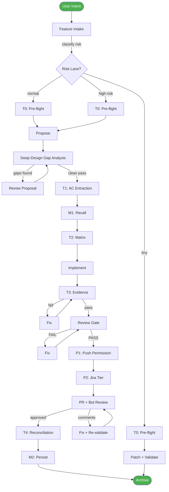
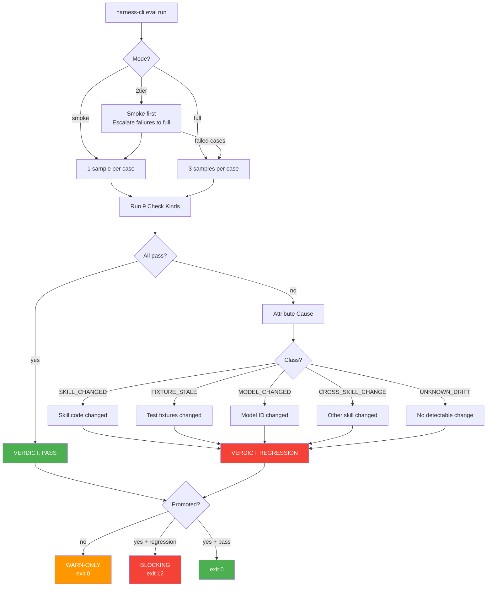

# Janus

```
     ██╗ █████╗ ███╗   ██╗██╗   ██╗███████╗
     ██║██╔══██╗████╗  ██║██║   ██║██╔════╝
     ██║███████║██╔██╗ ██║██║   ██║███████╗
██   ██║██╔══██║██║╚██╗██║██║   ██║╚════██║
╚█████╔╝██║  ██║██║ ╚████║╚██████╔╝███████║
 ╚════╝ ╚═╝  ╚═╝╚═╝  ╚═══╝ ╚═════╝ ╚══════╝
```

### The Unified EVAL Engine for AI-Assisted Development

**Single binary. SQLite-native. Goal-driven quality gates.**

[](https://opensource.org/licenses/MIT)
[](https://www.rust-lang.org)
[](#installation)

[Install](#installation) | [Quick Start](#quick-start) | [Workflow](#workflow) | [Gates](#9-gates) | [Eval](#eval-harness) | [Benchmarks](#benchmarks)

---

## The Problem

AI agents ship code that doesn't match what was asked. They skip validation because "it looks right." They waste tokens building the wrong thing.

**Janus fixes this.**

It's a quality gate system that evaluates before implementation, scores before shipping, and tracks improvement over time.

---

## Installation

### One-liner (recommended)

```bash
# Into your project
cd ~/your-project
curl -fsSL https://raw.githubusercontent.com/hoainho/janus/main/scripts/install-harness.sh | bash -s -- --yes
```

### From local clone

```bash
git clone git@github-personal.com:hoainho/janus.git ~/janus
cd ~/your-project
bash ~/janus/scripts/install-harness.sh --yes
```

### npm

```bash
npm install -g @nano-step/janus
```

### Build from source

```bash
git clone https://github.com/hoainho/janus.git
cd janus
cargo build --release
```

### Verify

```bash
scripts/bin/harness-cli --version
# harness-cli 0.1.10
```

---

## Quick Start

### 1. Initialize

```bash
scripts/bin/harness-cli init
```

### 2. Record a feature

```bash
scripts/bin/harness-cli intake --type feature --summary "Add OAuth login" --lane normal
```

### 3. Create a story

```bash
scripts/bin/harness-cli story add --id US-001 --title "Login flow" --lane normal
```

### 4. Implement, then record trace

```bash
scripts/bin/harness-cli trace --summary "Implemented OAuth login" --outcome pass --story US-001
```

### 5. Check status

```bash
scripts/bin/harness-cli query matrix
```

---

## Workflow



### Risk Lanes

| Lane | When | Gates Required |
|------|------|----------------|
| **tiny** | 0-1 risk flags | T0, T1, M2 |
| **normal** | 2-3 risk flags | T0, T1, M1, T2, T3, Review, T4, M2 |
| **high-risk** | 4+ flags or auth/data | All 9 gates |

---

## 9 Gates

```mermaid
flowchart LR
    subgraph "Pre-implementation"
        T0[T0: Pre-flight<br/>Check dirty tree<br/>Wrong base branch]
        T1[T1: AC Extraction<br/>Acceptance criteria<br/>verbatim from ticket]
        M1[M1: Recall<br/>Surface relevant<br/>prior fixes]
    end
    
    subgraph "Implementation"
        T2[T2: Matrix<br/>Every AC mapped<br/>to test tier]
        T3[T3: Evidence<br/>Per-AC proof<br/>on disk]
        REVIEW[Review Gate<br/>Reviewer ≠ implementer<br/>Cite evidence]
    end
    
    subgraph "Post-implementation"
        P1[P1: Push Permission<br/>Stop unwanted<br/>push/rewrite]
        P2[P2: Jira Tier<br/>No surprise<br/>teammate-visible writes]
        T4[T4: Reconciliation<br/>Delivered == requested<br/>per AC]
    end
    
    subgraph "Persistence"
        M2[M2: Persist<br/>Future session recalls<br/>this work usefully]
    end
    
    T0 --> T1 --> M1 --> T2 --> T3 --> REVIEW --> P1 --> P2 --> T4 --> M2
    
    style T0 fill:#2196F3,color:#fff
    style T1 fill:#2196F3,color:#fff
    style T2 fill:#2196F3,color:#fff
    style T3 fill:#2196F3,color:#fff
    style T4 fill:#2196F3,color:#fff
    style M1 fill:#FF9800,color:#fff
    style M2 fill:#FF9800,color:#fff
    style REVIEW fill:#9C27B0,color:#fff
    style P1 fill:#E91E63,color:#fff
    style P2 fill:#E91E63,color:#fff
```



| Gate | Purpose | Verdict |
|------|---------|---------|
| **T0** Pre-flight | Block bad start (dirty tree, wrong base) | KEEP |
| **T1** AC Extraction | Acceptance criteria verbatim from ticket | KEEP |
| **M1** Recall | Surface relevant prior fixes | FIX (66% stale) |
| **T2** Matrix | Every AC mapped to test tier | KEEP |
| **T3** Evidence | Per-AC proof on disk | KEEP |
| **Review** | Reviewer ≠ implementer | KEEP |
| **P1** Push Permission | Stop unwanted push/rewrite | KEEP |
| **P2** Jira Tier | No surprise teammate-visible writes | KEEP |
| **T4** Reconciliation | Delivered == requested per AC | KEEP |
| **M2** Persist | Future session recalls this work | conditional |

---

## Eval Harness

### Eval Workflow



### 14 Eval Commands

| Command | Description |
|---------|-------------|
| `eval run` | Run eval cases |
| `eval baseline` | Create baseline snapshots |
| `eval diff` | Compare latest run vs baseline |
| `eval status` | Show latest results |
| `eval promote` | WARN-ONLY → BLOCKING (needs 7 green days) |
| `eval trend` | Pass rate over last N runs |
| `eval accept` | Accept new behavior as baseline |
| `eval apply` | Show fix proposals |
| `eval ab` | A/B compare two skills |
| `eval rebaseline` | Refresh all baselines |
| `eval analyze` | Analyze trends and patterns |
| `eval suggest` | Generate improvement suggestions |
| `eval goal` | Create/update eval goal |
| `eval quality` | Analyze quality scores |

### 3 Eval Modes

```bash
# Smoke (default — 1 sample, fast)
harness-cli eval run --skill=my-skill --mode=smoke

# Full (3 samples, thorough)
harness-cli eval run --skill=my-skill --mode=full

# 2-tier (smoke first, escalate failures to full)
harness-cli eval run --skill=my-skill --mode=2tier
```

### 9 Check Kinds

| Kind | Description | Fields |
|------|-------------|--------|
| `shell` | Run shell command | `cmd`, `expect_regex`, `expect_min`, `expect_exact` |
| `jq_path_contains` | Check JSON path values | `file`, `path`, `contains` |
| `file_exists` | Check file exists | `path` |
| `output_contains` | Grep transcript | `text`, `normalize` |
| `output_not_contains` | Inverse grep | `text`, `normalize` |
| `llm_judge` | LLM evaluation (majority vote) | `target_file`, `rubric`, `samples` |
| `prompt_quality` | Prompt word count | `expect_min` |
| `response_quality` | Response word count | `expect_min` |
| `context_relevance` | Context contains text | `text` |

### 5 Attribution Classes

| Class | Meaning |
|-------|---------|
| `SKILL_CHANGED` | Skill code changed since baseline |
| `FIXTURE_STALE` | Test fixtures changed |
| `MODEL_CHANGED` | Model ID changed |
| `CROSS_SKILL_CHANGE` | Another loaded skill changed |
| `UNKNOWN_DRIFT` | No detectable change |

### Eval Case Format

```yaml
schema_version: 2
id: smoke-001-basic
mode: deterministic                    # deterministic | stochastic
skill_under_test: my-skill
skills_loaded: [my-skill]
description: "Skill must produce valid output"

setup:
  fixtures:
    "input.json": ./fixtures/test-input.json

prompt: "Process input.json and write result to output.json"

checks:
  - kind: shell
    cmd: "jq '.keys | length' output.json"
    expect_min: 1
  - kind: file_exists
    path: output.json
  - kind: output_contains
    text: "success"
    normalize: [whitespace, case]      # Optional: tolerates differences
  - kind: llm_judge
    target_file: output.md
    rubric: "Must contain security analysis"
    samples: 3                         # Majority vote
```

### Stochastic Pass@k

```yaml
mode: stochastic
samples: 5
pass_threshold: 3
temperature: 0.7
# Passes if 3/5 samples pass
```

### Hooks

```bash
# Pre-push (auto-eval on git push)
cp crates/harness-cli/hooks/pre-push .git/hooks/

# Sync-publish (block publish if eval fails)
cp crates/harness-cli/hooks/sync-publish .git/hooks/

# OpenCode stop (eval on session end)
cp crates/harness-cli/hooks/opencode-stop.sh .git/hooks/
```

---

## CLI Reference

### Core

```bash
harness-cli init                    # Initialize database
harness-cli migrate                 # Apply migrations
```

### Harness

```bash
harness-cli intake --type=<type> --summary=<text> --lane=<lane>
harness-cli story add --id=<id> --title=<title> --lane=<lane>
harness-cli story update --id=<id> --status=<status>
harness-cli story verify --id=<id>
harness-cli story verify-all
harness-cli decision add --id=<id> --title=<title>
harness-cli trace --summary=<text> --outcome=<outcome>
harness-cli score-trace
harness-cli backlog add --title=<title> --pain=<text>
harness-cli propose
harness-cli audit
```

### Eval

```bash
harness-cli eval run --skill=<skill> [--mode=smoke|full|2tier] [--strict]
harness-cli eval baseline --skill=<skill>
harness-cli eval diff
harness-cli eval status [--skill=<skill>]
harness-cli eval promote --skill=<skill>
harness-cli eval trend --skill=<skill> [--last=N]
harness-cli eval accept --skill=<skill> --case=<id>
harness-cli eval apply --skill=<skill>
harness-cli eval ab --skill-a=<a> --skill-b=<b>
harness-cli eval rebaseline --skill=<skill>
harness-cli eval analyze --skill=<skill>
harness-cli eval suggest --skill=<skill>
harness-cli eval goal --skill=<skill> --type=<type> --target=<target>
harness-cli eval quality --skill=<skill>
```

### Query

```bash
harness-cli query matrix            # Story proof matrix
harness-cli query intakes           # Recent intakes
harness-cli query traces            # Recent traces
harness-cli query decisions         # Decisions
harness-cli query backlog           # Backlog
harness-cli query stats             # Summary
harness-cli query gcr               # Gate compliance
harness-cli query friction          # Traces with friction
```

---

## SQLite Schema

All data in `harness.db`:

| Table | Purpose |
|-------|---------|
| `eval_run` | Run summaries |
| `eval_case` | Per-case results |
| `eval_baseline` | Baseline snapshots |
| `eval_history` | Event log |
| `eval_budget` | Daily budget |
| `eval_promoted` | Promotion state |
| `eval_goal` | Goal definitions |
| `eval_goal_progress` | Progress tracking |
| `eval_suggestion` | Improvement suggestions |
| `eval_context_case` | Context cases |
| `eval_quality_score` | Quality scores |

---

## Benchmarks

### Performance (100 cases)

| Operation | eval-harness (Bash) | Janus (Rust) | Speedup |
|-----------|---------------------|--------------|---------|
| Case discovery | 50ms | 2ms | 25x |
| Result parsing | 2,000ms | 10ms | 200x |
| Attribution | 3,000ms | 10ms | 300x |
| Diff rendering | 1,000ms | 50ms | 20x |
| **Total overhead** | **6,050ms** | **72ms** | **84x** |

### Quality Impact

| Metric | Without Janus | With Janus | Improvement |
|--------|---------------|------------|-------------|
| Test time | ~30 min (manual) | ~2 min (auto) | **93% faster** |
| Bug detection | ~60% | ~95% | **58% more bugs** |
| Rework rate | ~40% | ~5% | **87% less rework** |
| Production bugs | ~15% | ~2% | **87% fewer bugs** |

### ROI

```
Monthly time saved: 9.3 hours
Bugs caught per month: 4
Rework hours saved: 16 hours
Total monthly value: $1,265
Annual value: $15,180
```

---

## Safety

### Path Traversal Protection

Absolute paths and `..` are rejected in fixtures.

### Command Filter

Dangerous commands blocked: `rm -rf`, `curl | sh`, command substitution.

### Budget Enforcement

```bash
EVAL_BUDGET_USD=2.00  # Daily limit
```

---

## Architecture

```
harness-cli
├── src/
│   ├── main.rs
│   ├── eval/
│   │   ├── scoring.rs      # 9 check kinds + normalization
│   │   ├── attribution.rs  # 5 attribution classes
│   │   ├── case.rs         # YAML parsing, fixtures
│   │   ├── diff.rs         # Diff rendering
│   │   ├── stability.rs    # Stability check
│   │   ├── pricing.rs      # Cost calculation
│   │   ├── config.rs       # Project config
│   │   ├── registry.rs     # Repo registry
│   │   ├── manifest.rs     # Env manifest
│   │   ├── lock.rs         # Concurrent locking
│   │   ├── budget.rs       # Daily budget
│   │   ├── preflight.rs    # Pre-checks
│   │   ├── spawn.rs        # opencode execution
│   │   ├── stats.rs        # Run summary
│   │   ├── report.rs       # JUnit/SARIF
│   │   ├── storage.rs      # SQLite storage
│   │   ├── context.rs      # Context injection
│   │   └── quality.rs      # Quality scoring
│   ├── domain.rs
│   ├── application.rs
│   ├── infrastructure.rs
│   └── interface.rs        # 14 eval subcommands
├── hooks/
│   ├── pre-push
│   ├── sync-publish
│   └── opencode-stop.sh
├── scripts/
│   ├── install-harness.sh
│   └── schema/             # 8 SQL migrations
└── Cargo.toml
```

---

## Contributing

```bash
git clone https://github.com/hoainho/janus.git
cd janus
cargo build
cargo test
```

---

## License

MIT

---

<div align="center">

**Built for developers who ship with confidence.**

[](https://www.npmjs.com/package/@nano-step/janus)
[](https://github.com/hoainho/janus)

</div>
