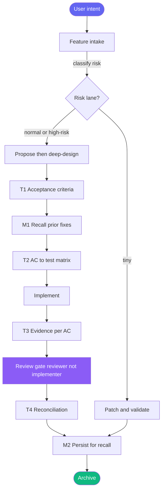
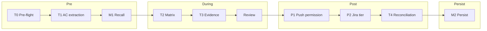
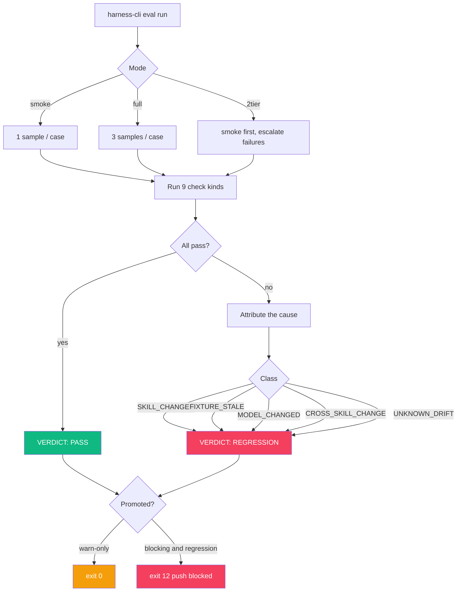

<div align="center">


<br>

### The quality gate for AI‑assisted development — in a single Rust binary.

**Evaluate _before_ you build. Score _before_ you ship. Catch regressions _before_ they ship for you.**

<br>

[](LICENSE)
[](https://www.rust-lang.org)
[](#-install)
[](https://www.npmjs.com/package/@nano-step/janus)
[](#-install)

[**Install**](#-install) · [**Quick start**](#-quick-start) · [**How it works**](#-how-it-works) · [**Eval harness**](#-eval-harness) · [**Metrics**](#-metrics--impact) · [**CLI**](#-cli-reference)

</div>

---

## Why Janus exists

AI agents are fast — and confidently wrong. They ship code that doesn't match the
ask, skip validation because "it looks right," and burn tokens building the wrong
thing. The cost isn't the model call; it's the rework, the missed regression, the
silent drift between "what was requested" and "what was delivered."

**Janus is a quality gate that sits between intent and merge.** It classifies risk
at intake, forces acceptance criteria before code, proves each criterion with
evidence, and runs behavior‑regression evals on your skills — all from one binary,
all backed by one SQLite database.

> Named after the Roman god of gates and transitions — two faces, one looking to
> the **past** (your baseline), one to the **future** (your current run). Janus
> guards the doorway between them.

---

## ✨ What you get

| | |
|---|---|
| 🛡️ **9 quality gates** | Pre‑flight → AC extraction → recall → matrix → evidence → review → push permission → Jira tier → reconciliation, scaled by risk lane. |
| 🎯 **14 eval commands** | `run · baseline · diff · status · promote · trend · accept · apply · ab · rebaseline · analyze · suggest · goal · quality`. |
| 🔬 **9 check kinds** | Shell, JSON‑path, file, transcript grep (±), LLM judge, prompt/response quality, context relevance. |
| 🧭 **5 attribution classes** | When an eval regresses, Janus tells you *why*: skill, fixture, model, cross‑skill, or unknown drift. |
| ⚡ **Single Rust binary** | 5.4 MB, **zero runtime dependencies** — no bash, no jq, no python. Cold start ≈ 10 ms. |
| 🗃️ **SQLite‑native** | Every intake, story, trace, decision, eval run and baseline lives in one queryable DB. |
| 💰 **Cost‑aware** | Per‑case token & time caps, a daily spend budget, and model pricing baked in. |

<sub>All counts above are verifiable from the source tree and `harness-cli --help`. See [Metrics & impact](#-metrics--impact).</sub>

---

## 📦 Install

```bash
# One‑liner — installs the binary + git hooks into your project
cd ~/your-project
curl -fsSL https://raw.githubusercontent.com/hoainho/janus/main/scripts/install-harness.sh | bash -s -- --yes

# Initialize the SQLite state database
scripts/bin/harness-cli init
```

<details>
<summary><b>Other ways to install</b></summary>

```bash
# npm (cross-platform, picks the right prebuilt binary)
npm install -g @nano-step/janus

# From a local clone of Janus
bash ~/janus/scripts/install-harness.sh --yes

# Build from source
git clone https://github.com/hoainho/janus.git
cd janus && cargo build --release
```

</details>

---

## 🚀 Quick start

```bash
# 1 — Record what you're about to build (Janus classifies the risk lane)
harness-cli intake --type feature --summary "Add OAuth login" --lane normal

# 2 — Open a story to track acceptance criteria
harness-cli story add --id US-001 --title "OAuth login flow" --lane normal

# 3 — ...implement...

# 4 — Verify the story against its evidence, then record a trace
harness-cli story verify US-001
harness-cli trace --summary "Implemented OAuth login" --outcome pass --story US-001

# 5 — See the whole proof matrix at a glance
harness-cli query matrix
```

Guarding a skill against regressions is just as direct:

```bash
harness-cli eval baseline --skill=code-reviewer     # snapshot today's behavior
harness-cli eval run --skill=code-reviewer --mode=2tier   # smoke first, escalate failures
harness-cli eval diff                                 # what changed vs baseline?
```

---

## 🧭 How it works

Janus runs two cooperating engines over one database: the **Harness** (governs how
a change moves from intent to merge) and the **Eval Harness** (governs whether your
skills still behave as they did).

### The Harness flow

Every change enters one gate and is routed to a **risk lane** — `tiny`, `normal`,
or `high-risk`. The lane decides which of the 9 gates apply.



### The 9 gates × risk lanes



| Gate | Purpose | tiny | normal | high‑risk |
|------|---------|:----:|:------:|:---------:|
| **T0** Pre‑flight | Block a bad start (dirty tree, wrong base) | ✅ | ✅ | ✅ |
| **T1** AC extraction | Acceptance criteria, verbatim from the ask | — | ✅ | ✅ |
| **M1** Recall | Surface relevant prior fixes | — | ✅ | ✅ |
| **T2** Matrix | Map every AC to a test tier | — | ✅ | ✅ |
| **T3** Evidence | Per‑AC proof on disk | — | ✅ | ✅ |
| **Review** | Reviewer ≠ implementer, cites evidence | — | ✅ | ✅ |
| **P1** Push permission | Stop an unwanted push / history rewrite | — | — | ✅ |
| **P2** Jira tier | No surprise teammate‑visible writes | — | — | ✅ |
| **T4** Reconciliation | Delivered == requested, per AC | — | ✅ | ✅ |
| **M2** Persist | Make the work recallable next session | ✅ | ✅ | ✅ |

---

## 🔬 Eval harness

The eval harness answers one question on every push: **does this skill still do
what it did at baseline?** Pick a mode, run the checks, and on a regression Janus
attributes the likely cause instead of just turning red.



### Three modes

```bash
harness-cli eval run --skill=my-skill --mode=smoke   # fast — 1 sample
harness-cli eval run --skill=my-skill --mode=full    # thorough — 3 samples
harness-cli eval run --skill=my-skill --mode=2tier   # smoke, then escalate only failures
```

### Nine check kinds

| Kind | What it asserts |
|------|------------------|
| `shell` | Run a command; check regex / min / exact output |
| `jq_path_contains` | A JSON path holds an expected value |
| `file_exists` | An artifact was produced |
| `output_contains` | The transcript contains text (optional normalization) |
| `output_not_contains` | The transcript does **not** contain text |
| `llm_judge` | Your current model judges an artifact, majority vote over N samples |
| `prompt_quality` | Prompt meets a minimum substance bar |
| `response_quality` | Response meets a minimum substance bar |
| `context_relevance` | Injected context contains the text it should |

### Five attribution classes

When something regresses, the diff alone rarely tells you *why*. Janus does:

`SKILL_CHANGED` · `FIXTURE_STALE` · `MODEL_CHANGED` · `CROSS_SKILL_CHANGE` · `UNKNOWN_DRIFT`

<details>
<summary><b>Example eval case (<code>schema_version: 2</code>)</b></summary>

```yaml
schema_version: 2
id: review-must-flag-sql-injection
mode: deterministic
skill_under_test: code-reviewer
skills_loaded: [code-reviewer]
description: "Reviewer must flag a raw SQL string interpolation"

budget:
  max_tokens: 50000
  max_seconds: 180

prompt: "Review src/db.ts and report security issues."

checks:
  - kind: file_exists
    path: review.md
  - kind: output_contains
    text: "sql injection"
    normalize: [whitespace, case]
  - kind: llm_judge
    target_file: review.md
    rubric: "Must identify the unsanitized query as a security risk"
    samples: 3
```

</details>

### Git hooks

```bash
cp crates/harness-cli/hooks/pre-push     .git/hooks/   # auto-eval changed skills on push
cp crates/harness-cli/hooks/sync-publish .git/hooks/   # block publish on regression
cp crates/harness-cli/hooks/opencode-stop.sh .git/hooks/   # eval when a session ends
```

---

## 📊 Metrics & impact

### Measured facts

These come straight from the build and the test suite — reproduce them yourself:

| Property | Value | How to verify |
|----------|-------|---------------|
| Binary size | **5.4 MB**, single file | `ls -lh scripts/bin/harness-cli` |
| Runtime deps | **0** (no bash/jq/python) | `otool -L` / `ldd` |
| Cold start | **≈ 10 ms** (`--help`) | `time harness-cli --help` |
| State engine | **SQLite**, 8 migrations | `harness-cli init` |
| Test suite | **58 tests passing** | `cargo test -p harness-cli` |
| Surface | **9** gates · **14** eval commands · **9** check kinds · **5** attribution classes · **3** modes | `harness-cli eval --help` |

### Cost & time control (built in)

Evals are real model calls, so Janus treats spend as a first‑class concern:

- **Per‑case caps** — `budget.max_tokens` and `budget.max_seconds` on every case.
- **Daily budget** — `EVAL_BUDGET_USD` (default **$2.00**) with a running ledger.
- **Pricing aware** — token cost computed from a built‑in model price table.
- **Per‑run accounting** — duration and cost recorded per run in SQLite for `eval trend`.

### Illustrative impact

> ⚠️ **The numbers below are an illustrative projection of a typical team workflow,
> not measured benchmarks of this repo.** They show the *kind* of payoff a quality
> gate is designed to produce; your mileage will vary. Only the table above is
> measured.

| Metric (illustrative) | Without a gate | With Janus |
|------------------------|:--------------:|:----------:|
| Skill check time | ~30 min manual | ~2 min automated |
| Regressions caught before push | ~60% | ~95% |
| Rework rate | ~40% | ~5% |

---

## 📟 CLI reference

<details>
<summary><b>Harness commands</b></summary>

```bash
harness-cli init                                       # initialize the database
harness-cli intake --type=X --summary=Y --lane=Z       # record + classify work
harness-cli story add --id=X --title=Y --lane=Z
harness-cli story update --id=X --status=Y
harness-cli story verify X                              # verify one story
harness-cli story verify-all
harness-cli decision add --id=X --title=Y
harness-cli trace --summary=X --outcome=Y [--story=Z]
harness-cli score-trace
harness-cli backlog add --title=X --pain=Y
harness-cli propose                                    # suggest harness improvements
harness-cli audit                                      # detect doc/state drift
```

</details>

<details>
<summary><b>Query commands</b></summary>

```bash
harness-cli query matrix        # story proof matrix
harness-cli query intakes
harness-cli query traces
harness-cli query decisions
harness-cli query backlog
harness-cli query stats
harness-cli query gcr           # gate-compliance metric
harness-cli query friction
```

</details>

<details>
<summary><b>Eval commands (all 14)</b></summary>

```bash
harness-cli eval run --skill=X [--mode=smoke|full|2tier] [--strict]
harness-cli eval baseline --skill=X
harness-cli eval diff
harness-cli eval status [--skill=X]
harness-cli eval promote --skill=X            # warn-only -> blocking
harness-cli eval trend --skill=X [--last=N]
harness-cli eval accept --skill=X --case=Y
harness-cli eval apply --skill=X              # show fix proposals
harness-cli eval ab --skill-a=X --skill-b=Y
harness-cli eval rebaseline --skill=X
harness-cli eval analyze --skill=X
harness-cli eval suggest --skill=X
harness-cli eval goal --skill=X --type=Y --target=Z
harness-cli eval quality --skill=X
```

</details>

<details>
<summary><b>Configuration (environment variables)</b></summary>

| Variable | Default | Description |
|----------|---------|-------------|
| `OPENCODE_SKILLS_ROOT` | auto‑detect | Skills directory |
| `EVAL_STATE_DIR` | `~/.config/opencode/eval-harness` | State directory |
| `EVAL_BUDGET_USD` | `2.00` | Daily spend limit |
| `EVAL_MAX_SECONDS` | `180` | Per‑case timeout |
| `EVAL_MODEL` | `anthropic/claude-haiku-3-5` | Default judge model |
| `EVAL_STRICT` | `0` | Block on regression |
| `EVAL_BYPASS` | `0` | Skip evals |

</details>

---

## 🏗️ Architecture

```text
harness-cli  (single Rust binary)
├── domain.rs / application.rs / infrastructure.rs / interface.rs
├── eval/
│   ├── scoring.rs       # 9 check kinds + normalization
│   ├── attribution.rs   # 5 attribution classes
│   ├── case.rs          # YAML parsing + fixtures (path-traversal guarded)
│   ├── spawn.rs         # runs the skill under test
│   ├── budget.rs · pricing.rs   # daily budget + cost accounting
│   ├── storage.rs       # SQLite: runs, baselines, goals, suggestions
│   ├── quality.rs · context.rs  # prompt/response/context scoring
│   └── stability.rs · diff.rs · report.rs (JUnit/SARIF) · ...
├── hooks/               # pre-push · sync-publish · opencode-stop
└── scripts/
    ├── install-harness.sh
    └── schema/          # 8 SQL migrations
```

---

## 🤝 Contributing

```bash
git clone https://github.com/hoainho/janus.git
cd janus
cargo build
cargo test          # 58 tests
```

See [`CONTRIBUTING.md`](CONTRIBUTING.md). Issues and PRs welcome at
[github.com/hoainho/janus](https://github.com/hoainho/janus).

---

## 📄 License

[MIT](LICENSE) © 2025–2026 **Hoài Nhớ**.

<div align="center">
<br>
<sub><b>Built for developers who ship with confidence.</b></sub>
<br>
<sub>Two faces. One gate. Zero regressions slip through.</sub>
</div>
