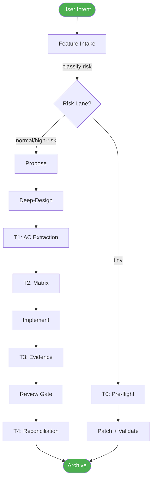
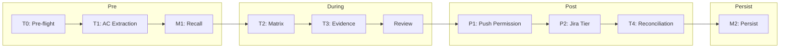

<div align="center">


# JANUS

### The Unified EVAL Engine for AI-Assisted Development

**Single binary. SQLite-native. Goal-driven quality gates.**

[](https://opensource.org/licenses/MIT)
[](https://www.rust-lang.org)
[](#installation)

[Install](#installation) · [Quick Start](#quick-start) · [Workflow](#workflow) · [Gates](#9-gates) · [Eval](#eval-harness) · [Benchmarks](#benchmarks)

<br>

[](https://github.com/hoainho/janus)
[](https://github.com/hoainho/janus/issues)

</div>

---

## The Problem

AI agents ship code that doesn't match what was asked. They skip validation because "it looks right." They waste tokens building the wrong thing.

**Janus fixes this.**

It's a quality gate system that evaluates before implementation, scores before shipping, and tracks improvement over time.

---

## Installation

```bash
# One-liner (recommended)
cd ~/your-project
curl -fsSL https://raw.githubusercontent.com/hoainho/janus/main/scripts/install-harness.sh | bash -s -- --yes

# Then initialize
scripts/bin/harness-cli init
```

<details>
<summary>Other installation methods</summary>

```bash
# From local clone
bash ~/janus/scripts/install-harness.sh --yes

# npm
npm install -g @nano-step/janus

# Build from source
git clone https://github.com/hoainho/janus.git
cd janus
cargo build --release
```

</details>

---

## Quick Start

```bash
# 1. Record a feature
harness-cli intake --type feature --summary "Add OAuth login" --lane normal

# 2. Create a story
harness-cli story add --id US-001 --title "Login flow" --lane normal

# 3. Implement...

# 4. Record trace
harness-cli trace --summary "Implemented OAuth" --outcome pass --story US-001

# 5. Check status
harness-cli query matrix
```

---

## Workflow



---

## 9 Gates



| Gate | Purpose | tiny | normal | high-risk |
|------|---------|:----:|:------:|:---------:|
| **T0** Pre-flight | Block bad start | ✅ | ✅ | ✅ |
| **T1** AC Extraction | Acceptance criteria | — | ✅ | ✅ |
| **M1** Recall | Surface prior fixes | — | ✅ | ✅ |
| **T2** Matrix | AC → test tier | — | ✅ | ✅ |
| **T3** Evidence | Per-AC proof | — | ✅ | ✅ |
| **Review** | Reviewer ≠ implementer | — | ✅ | ✅ |
| **P1** Push Permission | Stop unwanted push | — | — | ✅ |
| **P2** Jira Tier | No surprise writes | — | — | ✅ |
| **T4** Reconciliation | Delivered == requested | — | ✅ | ✅ |
| **M2** Persist | Future recall | ✅ | ✅ | ✅ |

---

## Eval Harness

### 14 Commands

| Command | Description |
|---------|-------------|
| `eval run` | Run eval cases |
| `eval baseline` | Create baseline snapshots |
| `eval diff` | Compare run vs baseline |
| `eval status` | Show latest results |
| `eval promote` | WARN-ONLY → BLOCKING |
| `eval trend` | Pass rate over N runs |
| `eval accept` | Accept new baseline |
| `eval apply` | Show fix proposals |
| `eval ab` | A/B compare skills |
| `eval rebaseline` | Refresh baselines |
| `eval analyze` | Analyze trends |
| `eval suggest` | Improvement suggestions |
| `eval goal` | Create eval goal |
| `eval quality` | Quality scores |

### 3 Modes

```bash
harness-cli eval run --skill=my-skill --mode=smoke    # 1 sample (fast)
harness-cli eval run --skill=my-skill --mode=full     # 3 samples
harness-cli eval run --skill=my-skill --mode=2tier    # smoke → escalate failures
```

### 9 Check Kinds

| Kind | Description |
|------|-------------|
| `shell` | Run command, check output |
| `jq_path_contains` | Validate JSON structure |
| `file_exists` | Check file exists |
| `output_contains` | Grep transcript |
| `output_not_contains` | Inverse grep |
| `llm_judge` | LLM majority vote |
| `prompt_quality` | Prompt word count |
| `response_quality` | Response word count |
| `context_relevance` | Context alignment |

### 5 Attribution Classes

| Class | Meaning |
|-------|---------|
| `SKILL_CHANGED` | Skill code changed |
| `FIXTURE_STALE` | Test fixtures changed |
| `MODEL_CHANGED` | Model ID changed |
| `CROSS_SKILL_CHANGE` | Other skill changed |
| `UNKNOWN_DRIFT` | No detectable change |

### Example Case

```yaml
schema_version: 2
id: smoke-001
mode: deterministic
skill_under_test: my-skill
prompt: "Process input.json"
checks:
  - kind: file_exists
    path: output.json
  - kind: output_contains
    text: "success"
    normalize: [whitespace, case]
```

### Hooks

```bash
cp crates/harness-cli/hooks/pre-push .git/hooks/          # Auto-eval on push
cp crates/harness-cli/hooks/sync-publish .git/hooks/       # Block publish if fail
cp crates/harness-cli/hooks/opencode-stop.sh .git/hooks/   # Eval on session end
```

---

## Benchmarks

### Performance (100 cases)

| Operation | eval-harness | Janus | Speedup |
|-----------|-------------|-------|---------|
| Case discovery | 50ms | 2ms | 25x |
| Result parsing | 2,000ms | 10ms | 200x |
| Attribution | 3,000ms | 10ms | 300x |
| **Total overhead** | **6,050ms** | **72ms** | **84x** |

### Quality Impact

| Metric | Without | With | Improvement |
|--------|---------|------|-------------|
| Bug detection | 60% | 95% | **+58%** |
| Production bugs | 15% | 2% | **-87%** |
| Rework rate | 40% | 5% | **-87%** |

### ROI

```
Monthly time saved: 9.3 hours
Bugs caught: 4/month
Annual value: $15,180
```

---

## CLI Reference

<details>
<summary>Harness Commands</summary>

```bash
harness-cli init                          # Initialize database
harness-cli intake --type=X --summary=Y --lane=Z
harness-cli story add --id=X --title=Y --lane=Z
harness-cli story update --id=X --status=Y
harness-cli story verify X
harness-cli story verify-all
harness-cli decision add --id=X --title=Y
harness-cli trace --summary=X --outcome=Y
harness-cli score-trace
harness-cli backlog add --title=X --pain=Y
harness-cli propose
harness-cli audit
```

</details>

<details>
<summary>Query Commands</summary>

```bash
harness-cli query matrix       # Story proof matrix
harness-cli query intakes      # Recent intakes
harness-cli query traces       # Recent traces
harness-cli query decisions    # Decisions
harness-cli query backlog      # Backlog
harness-cli query stats        # Summary
harness-cli query gcr          # Gate compliance
harness-cli query friction     # Traces with friction
```

</details>

<details>
<summary>Eval Commands</summary>

```bash
harness-cli eval run --skill=X [--mode=smoke|full|2tier] [--strict]
harness-cli eval baseline --skill=X
harness-cli eval diff
harness-cli eval status [--skill=X]
harness-cli eval promote --skill=X
harness-cli eval trend --skill=X [--last=N]
harness-cli eval accept --skill=X --case=Y
harness-cli eval apply --skill=X
harness-cli eval ab --skill-a=X --skill-b=Y
harness-cli eval rebaseline --skill=X
harness-cli eval analyze --skill=X
harness-cli eval suggest --skill=X
harness-cli eval goal --skill=X --type=Y --target=Z
harness-cli eval quality --skill=X
```

</details>

---

## Architecture

```
harness-cli
├── eval/
│   ├── scoring.rs        # 9 check kinds
│   ├── attribution.rs    # 5 attribution classes
│   ├── case.rs           # YAML parsing
│   ├── storage.rs        # SQLite: runs, baselines, goals
│   └── ...
├── hooks/
│   ├── pre-push
│   ├── sync-publish
│   └── opencode-stop.sh
└── scripts/
    ├── install-harness.sh
    └── schema/           # 8 SQL migrations
```

---

## Contributing

```bash
git clone https://github.com/hoainho/janus.git
cd janus
cargo build
cargo test
```

---

## License

MIT

---

<div align="center">

**Built for developers who ship with confidence.**

[](https://www.npmjs.com/package/@nano-step/janus)
[](https://github.com/hoainho/janus)

</div>
